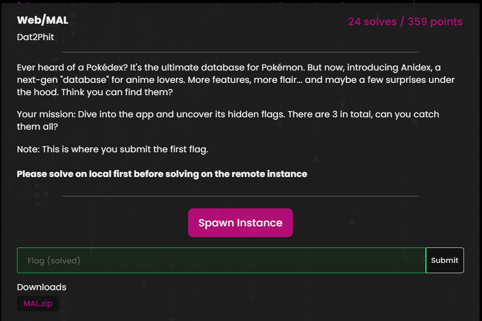

Đây là Writeup HCMUS CTF 2025 của team VSL.T1. Sau 2 ngày kết thúc cuộc thi, mình vừa rảnh rỗi thì quyết định viết ngắn gọn và đầy đủ hơn lại một Writeup về mảng Web và PWN của giải vì các challenge hay quá ^^. Rất cảm ơn btc và author đã vắt chất xám ra để tạo nên được những challenge này. orz

Mã nguồn của các challenge các bạn có thể tải ở đây: [Link](https://github.com/d4kw1n/ctf-storage/tree/main/2025/HCMUS-CTF-Qual)

# Web

## Web/AsiaCCS

Challenge này được cung cấp mã nguồn. Mình review source thì phát hiện lỗ hổng SQL Injection ở trong hàm `query_by_affiliation()`.

Đồng thời, flag cũng được lưu ở trong DB

⇒ Từ đây có thể đoán được bài này dùng SQLi để get được flag

Dùng payload: `%' UNION SELECT flag, flag, flag FROM flag -- -`

> Flag: `HCMUS-CTF{vibe-coding_more-jobs-for-pentesters!!}`

## Web/MAL

